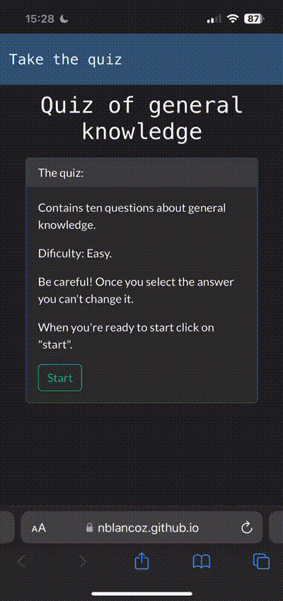

<h1 align="center">Proyecto Quiz</h1>

## About the project
In this project the user will do a quiz of ten questions about some general knowledge, the difficulty is easy.

## The technologies that I used

  

## Summary of the project
<ul>
    <li>
    DOM Elements: The code identifies and store the elements of the DOM that represents different parts of the user interface, such as buttons, containers and messages.
    </li>
    <li>
    SPA: The Single Page Application allows to the user feel that is navigating into different pages ejecuting some functions, but what it actually do is hiding and showing elements to give the sensation of navigation.
    </li>
    <li>
    API request: The questions came from an API that is being called in the JavaScript and allows to print and show the ten questions that were created in the API.
    </li>
    <li>
    Results: At the moment you end the test, it shows a card in which it prints your score. The better your result was, more happiness you will give to Ronaldo.
    </li>
</ul>

## Preview

- Preview of the quiz

### Licence
This project is under licence of Nicolás Blanco Zappalá

### Contact
  

 Nicolás Blanco Zappalá

     

